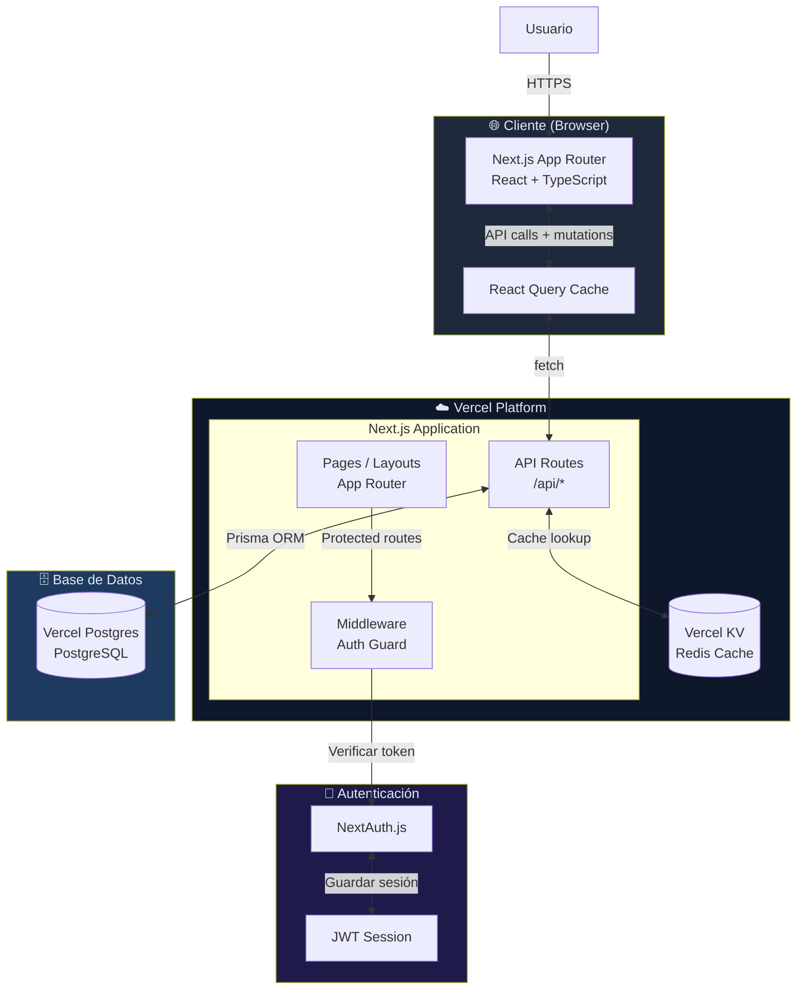
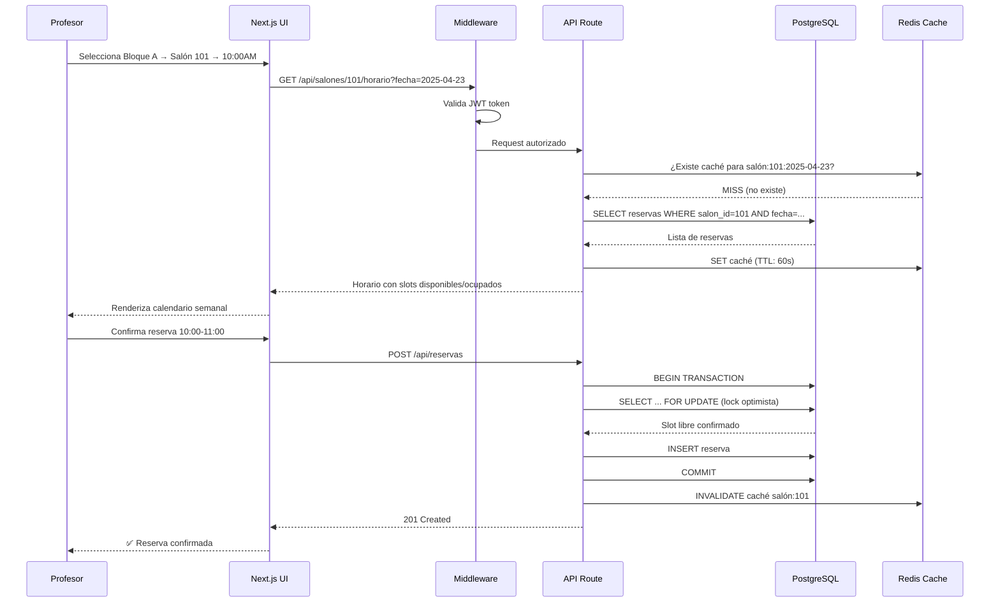
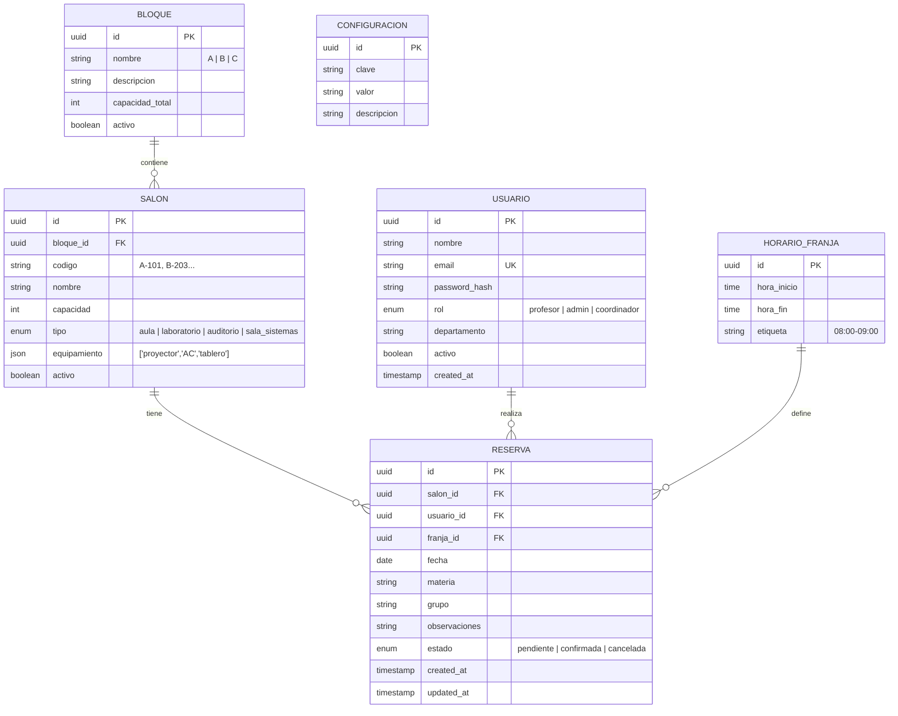
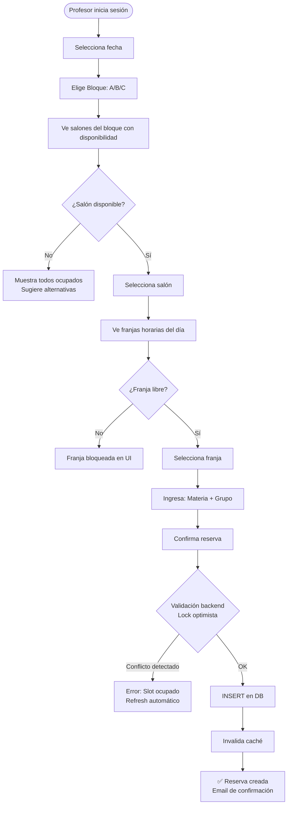
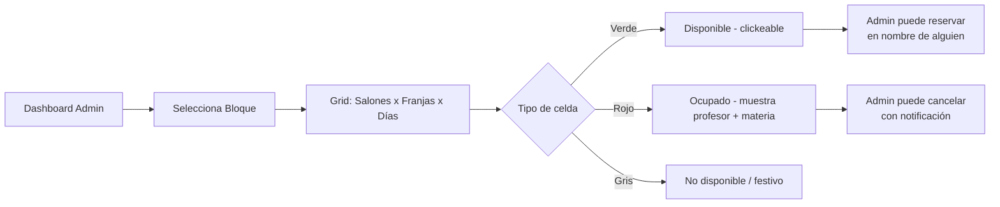

# 🏛️ ClassSport — Arquitectura del Sistema

> Documento técnico de arquitectura para la plataforma de gestión de salones universitarios.

---

## 1. Stack Tecnológico Recomendado

### Frontend
| Tecnología | Versión | Justificación |
|---|---|---|
| **Next.js** | 14+ (App Router) | SSR/SSG nativo, excelente para dashboards con datos en tiempo real, ideal para Vercel |
| **TypeScript** | 5+ | Tipado estático reduce errores en lógica de reservas y conflictos de horarios |
| **Tailwind CSS** | 3+ | Desarrollo rápido de UI, consistencia visual, sin overhead de CSS personalizado |
| **shadcn/ui** | Latest | Componentes accesibles y personalizables (calendarios, modales, tablas) |
| **React Query (TanStack)** | 5+ | Gestión de estado servidor, caché automático, revalidación de reservas |
| **date-fns** | 3+ | Manipulación de fechas/franjas horarias sin dependencias pesadas |

### Backend
| Tecnología | Versión | Justificación |
|---|---|---|
| **Next.js API Routes** | 14+ | Backend dentro del mismo proyecto, deploy unificado en Vercel, reduce latencia |
| **Prisma ORM** | 5+ | Type-safe queries, migraciones automáticas, compatible con múltiples DBs |
| **PostgreSQL** | 15+ | Relacional: ideal para constraints de unicidad (salón + hora + fecha), transacciones ACID |
| **NextAuth.js** | 5+ | Autenticación lista (OAuth, credentials), sesiones JWT/DB |

### Infraestructura (Vercel-native)
| Tecnología | Justificación |
|---|---|
| **Vercel** | Deploy automático desde GitHub, Edge Network, preview environments por PR |
| **Vercel Postgres** | PostgreSQL gestionado integrado con Vercel, zero config |
| **Vercel KV (Redis)** | Caché de horarios consultados frecuentemente, rate limiting |

---

## 2. Diagrama de Arquitectura



### Flujo de Datos por Capa



---

## 3. Modelo de Datos

### Entidades Principales



### Constraints Críticos en DB

```sql
-- Evita reservas duplicadas: mismo salón, misma franja, misma fecha
ALTER TABLE reservas ADD CONSTRAINT unique_reserva
  UNIQUE (salon_id, franja_id, fecha);

-- Solo reservas en días hábiles (lunes-viernes)
ALTER TABLE reservas ADD CONSTRAINT dia_habil
  CHECK (EXTRACT(DOW FROM fecha) BETWEEN 1 AND 5);

-- Índices de rendimiento
CREATE INDEX idx_reservas_salon_fecha ON reservas(salon_id, fecha);
CREATE INDEX idx_reservas_usuario ON reservas(usuario_id);
CREATE INDEX idx_reservas_fecha ON reservas(fecha);
```

---

## 4. Flujos Principales del Sistema

### Flujo 1: Reserva de Salón



### Flujo 2: Vista Semanal de Salón (Admin/Coordinador)



---

## 5. Seguridad y Escalabilidad

### Seguridad

| Capa | Medida |
|---|---|
| **Autenticación** | JWT con expiración corta (15min) + Refresh tokens (7 días) |
| **Autorización** | RBAC: profesor solo ve/crea sus reservas; admin gestiona todo |
| **API** | Rate limiting via Vercel KV (max 30 req/min por usuario) |
| **DB** | Prepared statements via Prisma (previene SQL injection) |
| **Inputs** | Validación con Zod en cliente y servidor |
| **Conflictos** | Transacciones DB con SELECT FOR UPDATE (lock pesimista en reservas) |
| **Sesiones** | NextAuth con CSRF protection nativo |

### Escalabilidad

| Aspecto | Estrategia |
|---|---|
| **Caché** | Redis (Vercel KV) para horarios consultados frecuentemente |
| **DB** | Connection pooling via Prisma + PgBouncer en producción |
| **Edge** | Middleware en Vercel Edge Network (auth checks sin latencia) |
| **Futuro** | Arquitectura lista para microservicios (API routes separables) |
| **Carga** | Vercel escala automáticamente funciones serverless |

---

*Versión: 1.0.0 | Proyecto: ClassSport | Arquitecto: IA Senior*
